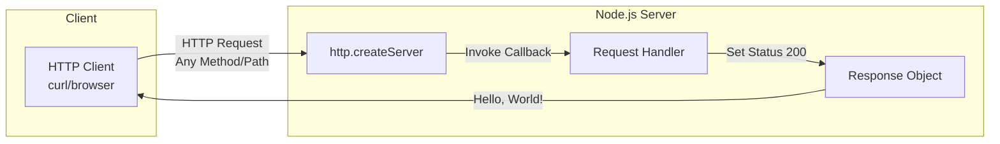
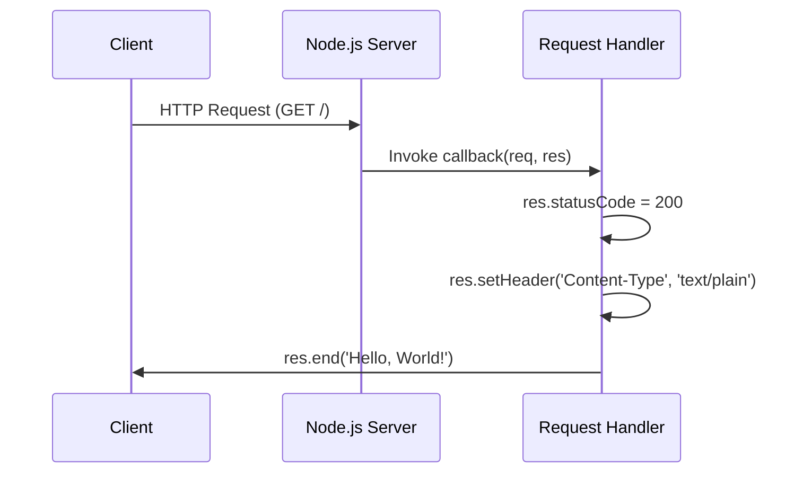

# Hello World Node.js Server

[](https://nodejs.org/)
[](https://opensource.org/licenses/MIT)
[](package.json)

A minimal HTTP server built with Node.js that responds with "Hello, World!" to all incoming requests. This project demonstrates the fundamentals of creating an HTTP server using Node.js built-in modules.

---

## Table of Contents

- [Overview](#overview)
- [Prerequisites](#prerequisites)
- [Installation](#installation)
- [Quick Start](#quick-start)
- [API Documentation](#api-documentation)
- [Code Walkthrough](#code-walkthrough)
- [Configuration](#configuration)
- [Deployment Guide](#deployment-guide)
- [Troubleshooting](#troubleshooting)
- [License](#license)

---

## Overview

This project provides a simple, lightweight HTTP server implementation using only Node.js core modules. It serves as an excellent starting point for learning Node.js server development or as a foundation for building more complex applications.

### Key Features

- **Zero Dependencies**: Uses only Node.js built-in `http` module
- **Lightweight**: Minimal codebase (~15 lines)
- **Easy to Understand**: Clear, readable code structure
- **Cross-Platform**: Runs on any platform that supports Node.js

### Architecture

The following diagram illustrates the client-server communication flow:



### Request Lifecycle



---

## Prerequisites

Before running this application, ensure you have the following installed:

| Requirement | Version | Description |
|------------|---------|-------------|
| **Node.js** | 20.x LTS (recommended) | JavaScript runtime environment |
| **npm** | 10.x+ | Package manager (included with Node.js) |

### Verifying Installation

Check your Node.js and npm versions:

```bash
# Check Node.js version
node --version
# Expected output: v20.x.x or higher

# Check npm version
npm --version
# Expected output: 10.x.x or higher
```

> **Note**: While this server will run on older Node.js versions (14.x+), we recommend using the latest LTS version for optimal performance and security.

---

## Installation

Follow these steps to set up the project on your local machine:

### Step 1: Clone the Repository

```bash
git clone <repository-url>
cd hello_world
```

### Step 2: Verify Project Structure

```bash
ls -la
# You should see:
# - server.js    (main server file)
# - package.json (project configuration)
# - README.md    (this documentation)
```

### Step 3: Verify Node.js Installation

```bash
node --version
```

> **Note**: This project uses only Node.js built-in modules, so there are no dependencies to install. You can skip `npm install`.

---

## Quick Start

Start the server with a single command:

```bash
# Using Node.js directly
node server.js

# Or using npm (if start script is configured)
npm start
```

### Expected Output

```
Server running at http://127.0.0.1:3000/
```

### Test the Server

Open a new terminal and run:

```bash
curl http://127.0.0.1:3000/
```

Or open your browser and navigate to: [http://127.0.0.1:3000/](http://127.0.0.1:3000/)

**Expected Response**: `Hello, World!`

---

## API Documentation

### Endpoint Overview

| Endpoint | Methods | Description |
|----------|---------|-------------|
| `http://127.0.0.1:3000/` | ALL (GET, POST, PUT, DELETE, etc.) | Returns "Hello, World!" response |

### Request Details

**URL**: `http://127.0.0.1:3000/`

**Supported Methods**: All HTTP methods are accepted (GET, POST, PUT, DELETE, PATCH, OPTIONS, HEAD)

**Request Headers**: None required

**Request Body**: Not processed (any body content is ignored)

**Path**: All paths return the same response (e.g., `/`, `/foo`, `/api/data`)

### Response Details

| Property | Value |
|----------|-------|
| **Status Code** | `200 OK` |
| **Content-Type** | `text/plain` |
| **Body** | `Hello, World!` |

### Examples

#### Using curl

```bash
# Basic GET request
curl http://127.0.0.1:3000/
# Output: Hello, World!

# GET request with verbose output
curl -v http://127.0.0.1:3000/
# Shows headers and response details

# POST request (also returns Hello, World!)
curl -X POST http://127.0.0.1:3000/
# Output: Hello, World!

# Request to any path
curl http://127.0.0.1:3000/api/test
# Output: Hello, World!
```

#### Using wget

```bash
wget -qO- http://127.0.0.1:3000/
# Output: Hello, World!
```

#### Using Browser

1. Open your web browser
2. Navigate to `http://127.0.0.1:3000/`
3. You will see "Hello, World!" displayed on the page

#### Using JavaScript (fetch)

```javascript
fetch('http://127.0.0.1:3000/')
  .then(response => response.text())
  .then(data => console.log(data));
// Output: Hello, World!
```

### Response Headers

When you make a request, the server responds with the following headers:

```
HTTP/1.1 200 OK
Content-Type: text/plain
Date: <current-date-time>
Connection: keep-alive
Keep-Alive: timeout=5
Transfer-Encoding: chunked
```

---

## Code Walkthrough

This section provides a detailed explanation of each part of `server.js`.

> **Source**: `/server.js`

### Module Import (Line 1)

```javascript
const http = require('http');
```

**Purpose**: Imports the Node.js built-in `http` module, which provides functionality to create HTTP servers and clients.

**Why `http`?**: This module is part of Node.js core, meaning no external dependencies are required. It provides low-level HTTP functionality that serves as the foundation for frameworks like Express.js.

### Server Configuration (Lines 3-4)

```javascript
const hostname = '127.0.0.1';
const port = 3000;
```

> **Source**: `/server.js:3-4`

**`hostname`**: The IP address the server binds to.
- `127.0.0.1` (localhost) means the server only accepts connections from the local machine
- Use `0.0.0.0` to accept connections from any network interface

**`port`**: The port number the server listens on.
- `3000` is a common development port
- Ports below 1024 typically require elevated privileges
- Common alternatives: 8080, 8000, 5000

### Server Creation (Lines 6-10)

```javascript
const server = http.createServer((req, res) => {
  res.statusCode = 200;
  res.setHeader('Content-Type', 'text/plain');
  res.end('Hello, World!\n');
});
```

> **Source**: `/server.js:6-10`

**`http.createServer(callback)`**: Factory method that creates a new HTTP server instance.

**Request Handler Callback Parameters**:
- `req` (`http.IncomingMessage`): Contains request information (method, URL, headers, body)
- `res` (`http.ServerResponse`): Used to construct and send the response

**Response Construction**:
1. `res.statusCode = 200`: Sets HTTP status to 200 (OK)
2. `res.setHeader('Content-Type', 'text/plain')`: Indicates the response body is plain text
3. `res.end('Hello, World!\n')`: Sends the response body and signals completion

### Server Startup (Lines 12-14)

```javascript
server.listen(port, hostname, () => {
  console.log(`Server running at http://${hostname}:${port}/`);
});
```

> **Source**: `/server.js:12-14`

**`server.listen(port, hostname, callback)`**: Binds the server to the specified address and starts listening for connections.

**Parameters**:
- `port`: Port number to bind to (3000)
- `hostname`: IP address to bind to (127.0.0.1)
- `callback`: Function called when the server starts successfully

**Startup Confirmation**: The callback logs a message confirming the server is running and provides the URL for access.

---

## Configuration

### Modifying the Server Address

To change the server's hostname or port, edit the constants in `server.js`:

```javascript
// Change these values as needed
const hostname = '127.0.0.1';  // IP address to bind to
const port = 3000;             // Port number to listen on
```

### Common Configuration Scenarios

| Scenario | hostname | port | Use Case |
|----------|----------|------|----------|
| Local development | `127.0.0.1` | `3000` | Default: only local access |
| Accept all connections | `0.0.0.0` | `3000` | Allow external connections |
| Alternative port | `127.0.0.1` | `8080` | Avoid port conflicts |
| Production (with proxy) | `127.0.0.1` | `3000` | Behind nginx/Apache |

### Using Environment Variables (Recommended for Production)

For production deployments, consider using environment variables:

```javascript
const hostname = process.env.HOST || '127.0.0.1';
const port = process.env.PORT || 3000;
```

Then run with:

```bash
HOST=0.0.0.0 PORT=8080 node server.js
```

---

## Deployment Guide

### Production Considerations

When deploying to production, consider the following:

#### 1. Process Manager (PM2)

Use PM2 to keep your server running and handle restarts:

```bash
# Install PM2 globally
npm install -g pm2

# Start the server with PM2
pm2 start server.js --name "hello-world"

# Enable startup script (auto-start on reboot)
pm2 startup
pm2 save

# Useful PM2 commands
pm2 status              # Check server status
pm2 logs hello-world    # View logs
pm2 restart hello-world # Restart server
pm2 stop hello-world    # Stop server
```

#### 2. Environment Variables

Configure the server using environment variables:

```bash
# Create a .env file (optional, requires dotenv package)
HOST=0.0.0.0
PORT=3000
NODE_ENV=production

# Or set directly
export HOST=0.0.0.0
export PORT=3000
node server.js
```

#### 3. Reverse Proxy (nginx)

For production, place the Node.js server behind a reverse proxy:

**nginx configuration example** (`/etc/nginx/sites-available/hello-world`):

```nginx
server {
    listen 80;
    server_name your-domain.com;

    location / {
        proxy_pass http://127.0.0.1:3000;
        proxy_http_version 1.1;
        proxy_set_header Upgrade $http_upgrade;
        proxy_set_header Connection 'upgrade';
        proxy_set_header Host $host;
        proxy_set_header X-Real-IP $remote_addr;
        proxy_set_header X-Forwarded-For $proxy_add_x_forwarded_for;
        proxy_cache_bypass $http_upgrade;
    }
}
```

Enable the site:

```bash
sudo ln -s /etc/nginx/sites-available/hello-world /etc/nginx/sites-enabled/
sudo nginx -t
sudo systemctl reload nginx
```

#### 4. Security Considerations

- **Keep Node.js updated**: Regularly update to the latest LTS version
- **Use HTTPS**: Configure SSL/TLS certificates (Let's Encrypt recommended)
- **Firewall rules**: Only expose necessary ports
- **Rate limiting**: Implement rate limiting for production APIs
- **Logging**: Add proper logging for monitoring and debugging

#### 5. Docker Deployment (Optional)

Create a `Dockerfile`:

```dockerfile
FROM node:20-alpine
WORKDIR /app
COPY package*.json ./
COPY server.js ./
EXPOSE 3000
USER node
CMD ["node", "server.js"]
```

Build and run:

```bash
docker build -t hello-world-node .
docker run -p 3000:3000 hello-world-node
```

---

## Troubleshooting

### Common Issues and Solutions

#### EADDRINUSE: Port Already in Use

**Error Message**:
```
Error: listen EADDRINUSE: address already in use 127.0.0.1:3000
```

**Cause**: Another process is already using port 3000.

**Solutions**:

```bash
# Find the process using the port
lsof -i :3000
# or
netstat -tulpn | grep 3000

# Kill the process (replace PID with actual process ID)
kill -9 <PID>

# Or use a different port
# Edit server.js and change: const port = 3001;
```

#### EACCES: Permission Denied

**Error Message**:
```
Error: listen EACCES: permission denied 127.0.0.1:80
```

**Cause**: Ports below 1024 require elevated privileges.

**Solutions**:
- Use a port above 1024 (e.g., 3000, 8080)
- Run with sudo (not recommended for production)
- Use a reverse proxy (nginx/Apache) to handle port 80

#### Connection Refused

**Error Message**:
```
curl: (7) Failed to connect to 127.0.0.1 port 3000: Connection refused
```

**Cause**: The server is not running or not listening on the expected address.

**Solutions**:
1. Verify the server is running:
   ```bash
   ps aux | grep node
   ```
2. Check server output for errors
3. Ensure you're using the correct hostname and port
4. If accessing from another machine, ensure `hostname` is set to `0.0.0.0`

#### Server Hangs or Doesn't Respond

**Possible Causes**:
- Infinite loop in request handler
- Blocking synchronous operation
- Memory leak

**Solutions**:
- Check for infinite loops in your code
- Use `Ctrl+C` to stop the server and restart
- Monitor memory usage with `top` or `htop`

### Debugging Tips

```bash
# Run with increased verbosity
NODE_DEBUG=http node server.js

# Check if server is listening
nc -zv 127.0.0.1 3000

# Test connectivity
curl -v http://127.0.0.1:3000/
```

---

## License

This project is licensed under the **MIT License**.

```
MIT License

Copyright (c) 2024 hxu

Permission is hereby granted, free of charge, to any person obtaining a copy
of this software and associated documentation files (the "Software"), to deal
in the Software without restriction, including without limitation the rights
to use, copy, modify, merge, publish, distribute, sublicense, and/or sell
copies of the Software, and to permit persons to whom the Software is
furnished to do so, subject to the following conditions:

The above copyright notice and this permission notice shall be included in all
copies or substantial portions of the Software.

THE SOFTWARE IS PROVIDED "AS IS", WITHOUT WARRANTY OF ANY KIND, EXPRESS OR
IMPLIED, INCLUDING BUT NOT LIMITED TO THE WARRANTIES OF MERCHANTABILITY,
FITNESS FOR A PARTICULAR PURPOSE AND NONINFRINGEMENT. IN NO EVENT SHALL THE
AUTHORS OR COPYRIGHT HOLDERS BE LIABLE FOR ANY CLAIM, DAMAGES OR OTHER
LIABILITY, WHETHER IN AN ACTION OF CONTRACT, TORT OR OTHERWISE, ARISING FROM,
OUT OF OR IN CONNECTION WITH THE SOFTWARE OR THE USE OR OTHER DEALINGS IN THE
SOFTWARE.
```

---

## Contributing

Contributions are welcome! Please feel free to submit issues and pull requests.

---

**Author**: hxu  
**Version**: 1.0.0  
**Last Updated**: 2024
