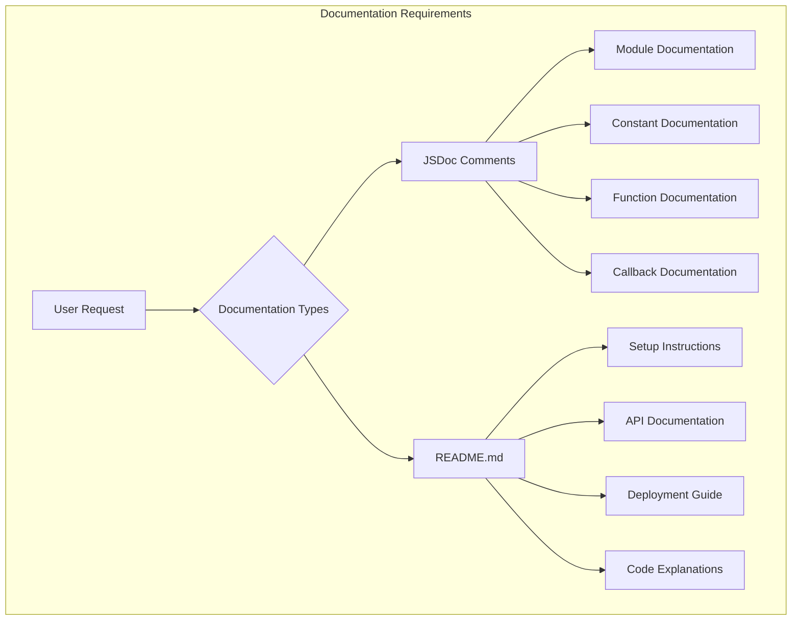
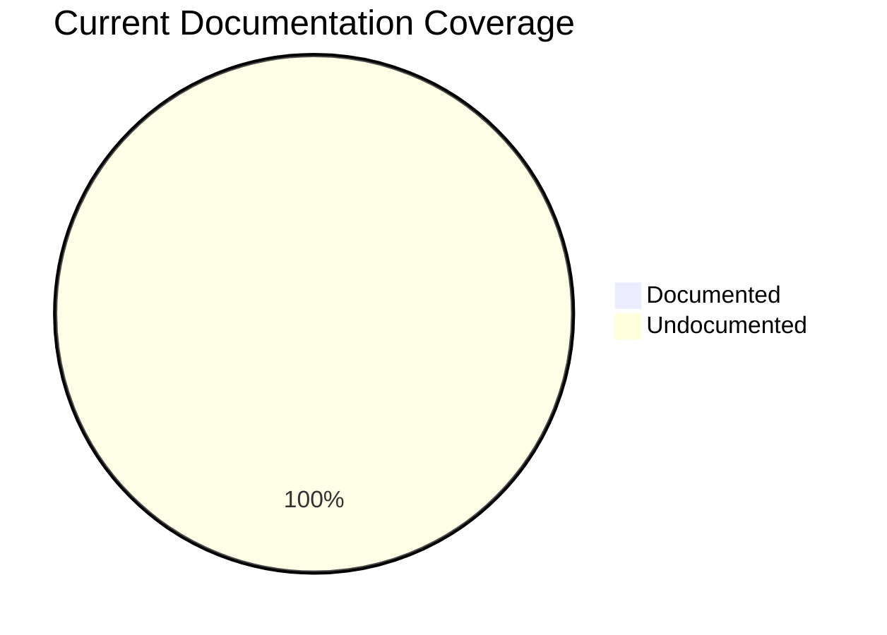
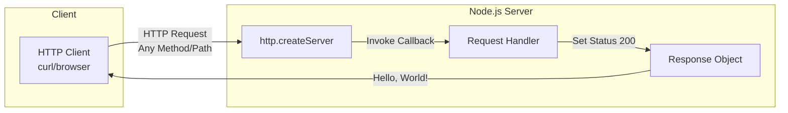
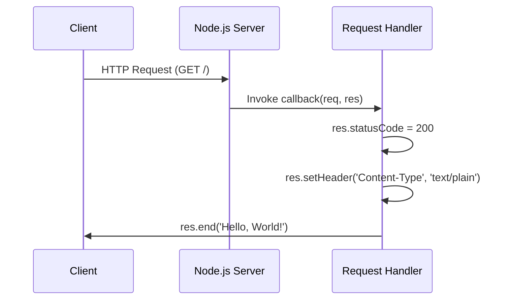
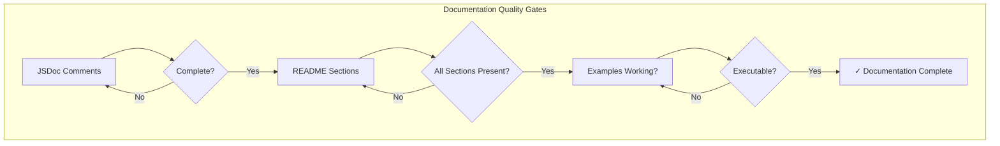
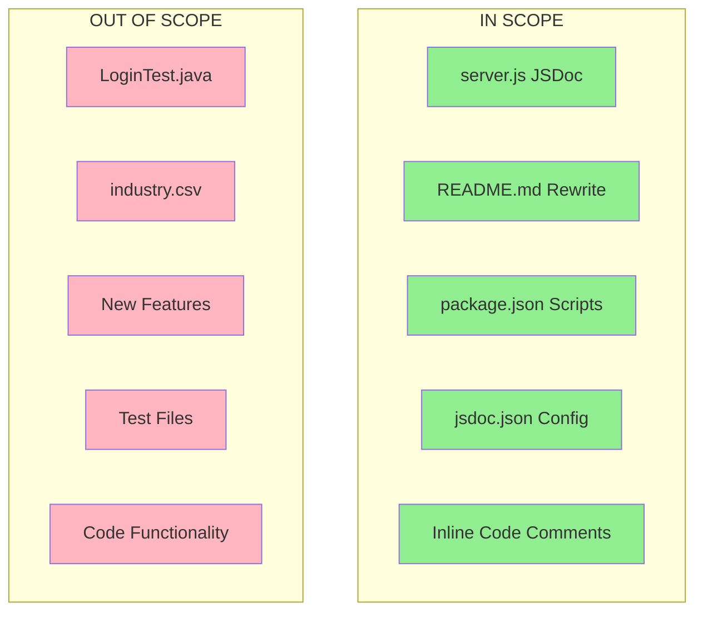
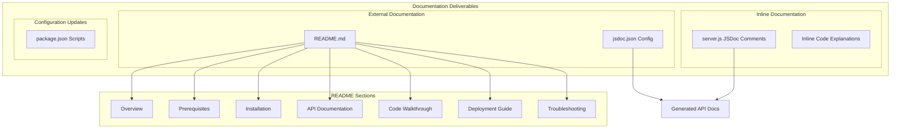

# Technical Specification

# 0. Agent Action Plan

## 0.1 Intent Clarification

### 0.1.1 Core Documentation Objective

Based on the provided requirements, the Blitzy platform understands that the documentation objective is to **create comprehensive, developer-focused documentation** for a minimal Node.js HTTP server application. This encompasses both inline code documentation (JSDoc comments) and external documentation (README with guides).

**Request Categorization:**
- **Primary Type:** Create new documentation + Update existing documentation
- **Documentation Types:** API docs, User guides (setup instructions), Technical specs (inline code explanations), Deployment guide, README enhancement

**Explicit Documentation Requirements:**
- Add JSDoc comments to all functions in `server.js`
- Create a comprehensive README with the following sections:
  - Setup instructions (environment, installation, running)
  - API documentation (endpoints, request/response formats)
  - Deployment guide (production deployment considerations)
  - Inline code explanations (how the server works)

**Implicit Documentation Needs (Inferred):**
- Document the module-level purpose of `server.js`
- Document constants (`hostname`, `port`) with type annotations
- Document the HTTP server creation and callback handler
- Add usage examples for developers consuming the API
- Include prerequisites (Node.js version requirements)
- Document error scenarios and troubleshooting steps

### 0.1.2 Special Instructions and Constraints

**Captured Directives:**
- No explicit style guide provided; use standard JSDoc conventions
- No template requirements specified; follow Node.js community best practices
- Comprehensive documentation requested, indicating thorough coverage expected

**Template Requirements:**
- No user-provided templates; will generate standard JSDoc and README formats

**Style Preferences:**
- JSDoc comments: Use `/** */` block comment style with proper tags
- README: Markdown format with clear section headers
- Code examples: Include runnable snippets with syntax highlighting
- Diagrams: Use Mermaid for architectural visualization

**Web Search Research Conducted:**
- JSDoc best practices for Node.js applications
- Latest JSDoc version: 4.0.5 (npm)
- JSDoc supports Markdown within comments for richer formatting
- ESLint plugin (eslint-plugin-jsdoc v61.5.0) available for enforcing standards

### 0.1.3 Technical Interpretation

These documentation requirements translate to the following technical documentation strategy:

- To **document server.js functions**, we will **add JSDoc comment blocks** immediately preceding each declaration, including:
  - Module-level `@file` and `@module` documentation
  - `@constant` tags for `hostname` and `port` with `@type` annotations
  - `@callback` documentation for the request handler
  - `@description`, `@param`, `@returns`, and `@example` tags as appropriate

- To **create comprehensive README**, we will **completely rewrite README.md** to include:
  - Project overview and purpose
  - Prerequisites and system requirements
  - Step-by-step setup instructions
  - API endpoint documentation with curl examples
  - Code walkthrough with inline explanations
  - Deployment guide with production considerations
  - Troubleshooting section

### 0.1.4 Inferred Documentation Needs

Based on repository analysis:
- **Module `server.js`**: Contains undocumented request handler callback and server lifecycle functions; requires JSDoc for all code elements
- **Configuration**: Hardcoded `hostname` and `port` constants need documentation explaining their purpose and how to modify them
- **Feature documentation**: HTTP server responds to all requests with "Hello, World!"; needs clear API documentation
- **User journey**: New developers need setup guide, usage examples, and deployment instructions



## 0.2 Documentation Discovery and Analysis

### 0.2.1 Existing Documentation Infrastructure Assessment

Repository analysis conducted using systematic deep search reveals the following documentation structure:

**Search Patterns Employed:**
- Documentation files: `README*`, `docs/**`, `*.md`, `*.mdx`, `*.rst`, `wiki/**`
- Documentation generators: `mkdocs.yml`, `docusaurus.config.js`, `jsdoc.json`, `typedoc.json`
- Style guides and templates: `CONTRIBUTING.md`, `STYLE_GUIDE.md`, `.editorconfig`

**Repository Analysis Findings:**

| Asset | Status | Location | Notes |
|-------|--------|----------|-------|
| README.md | Exists (minimal) | `/README.md` | Contains only project name and warning |
| JSDoc Configuration | Missing | N/A | No `jsdoc.json` or `jsdoc.conf.json` found |
| Documentation Folder | Missing | N/A | No `docs/` directory exists |
| API Documentation | Missing | N/A | No OpenAPI/Swagger specs found |
| Code Comments | Missing | `server.js` | No JSDoc or inline comments present |

**Current Documentation Framework:**
- **Documentation Generator**: None configured
- **API Documentation Tools**: None detected
- **Diagram Tools**: None configured (Mermaid recommended for addition)
- **Documentation Hosting**: Not configured

**Existing README.md Analysis:**

```
# hao-backprop-test
test project for backprop integration. Do not touch!
```

This minimal README provides:
- Project name identifier only
- No setup instructions, API documentation, or usage guidance
- Warning about modification (will be replaced with comprehensive documentation per requirements)

### 0.2.2 Repository Code Analysis for Documentation

**Search Patterns Used for Code to Document:**
- Entry points: `server.js`, `index.js`, `app.js`
- Configuration files: `package.json`, `*.config.js`
- Module exports: Files with `module.exports` or `export` statements

**Key Files Examined:**

| File | Path | Documentation Status | Elements to Document |
|------|------|---------------------|---------------------|
| server.js | `/server.js` | Undocumented | Module, constants (2), server creation, request handler callback, listen call |
| package.json | `/package.json` | N/A (Manifest) | Project metadata reference |

**server.js Code Structure Analysis:**

```javascript
// Line 1: Module import (require statement)
const http = require('http');

// Lines 3-4: Configuration constants
const hostname = '127.0.0.1';
const port = 3000;

// Lines 6-10: Server creation with request handler
const server = http.createServer((req, res) => {
  // Request handling logic
});

// Lines 12-14: Server start with callback
server.listen(port, hostname, () => {
  // Startup confirmation
});
```

**Elements Requiring JSDoc Documentation:**
- `@file` - Module-level description
- `@module` - Module identification
- `hostname` constant - `@constant`, `@type {string}`
- `port` constant - `@constant`, `@type {number}`
- Request handler callback - `@callback`, `@param {http.IncomingMessage}`, `@param {http.ServerResponse}`
- Server instance - `@type {http.Server}`

### 0.2.3 Web Search Research Conducted

**JSDoc Best Practices Research:**

- JSDoc comments must start with `/**` sequence to be recognized by the parser (Source: jsdoc.app)
- Best practice: "Document as you code" to ensure documentation stays up-to-date
- Use `@param`, `@returns`, `@type`, `@constant`, and `@example` tags for comprehensive coverage
- JSDoc supports Markdown within comments for richer formatting
- For Node.js modules, use `@module` tag for module identification
- Recommended template: docdash for better readability

**Documentation Standards Identified:**
- Follow JSDoc 3 syntax specification
- Include working code examples for all public APIs
- Provide inline comments explaining "why" not just "what"
- Use consistent formatting throughout codebase

## 0.3 Documentation Scope Analysis

### 0.3.1 Code-to-Documentation Mapping

**Modules Requiring Documentation:**

**Module: server.js (Primary Target)**

| Element | Type | Line(s) | Current Documentation | Documentation Needed |
|---------|------|---------|----------------------|---------------------|
| Module header | File | 1 | Missing | `@file`, `@module`, `@author`, `@version`, `@license` |
| `http` import | Require | 1 | Missing | `@requires` tag |
| `hostname` | Constant | 3 | Missing | `@constant`, `@type {string}`, `@default`, description |
| `port` | Constant | 4 | Missing | `@constant`, `@type {number}`, `@default`, description |
| Request handler | Callback | 6-10 | Missing | `@callback`, `@param {http.IncomingMessage}`, `@param {http.ServerResponse}` |
| `server` | Variable | 6 | Missing | `@type {http.Server}`, description |
| Server listener | Method call | 12-14 | Missing | Inline comments explaining startup behavior |

**Configuration Options Requiring Documentation:**

| Config Element | File | Currently Documented | Documentation Required |
|---------------|------|---------------------|----------------------|
| hostname binding | server.js:3 | No | Purpose, how to modify, security implications |
| port number | server.js:4 | No | Purpose, how to modify, common port conflicts |
| npm scripts | package.json | Partial | Add `start` script, document test script |

**Features Requiring User Guides:**

| Feature | Current Coverage | Gaps to Address |
|---------|-----------------|-----------------|
| HTTP Server | None | Complete server architecture explanation |
| API Endpoints | None | Request/response documentation, examples |
| Project Setup | None | Installation, prerequisites, environment setup |
| Deployment | None | Production deployment guide, environment variables |

### 0.3.2 Documentation Gap Analysis

Given the requirements and repository analysis, documentation gaps include:

**Undocumented Code Elements (Critical):**
- All server.js code elements (100% undocumented)
- No module-level documentation exists
- No inline explanations of request handling logic

**Missing User Documentation (Critical):**
- No setup instructions for new developers
- No API documentation for consumers
- No deployment guidance for production use
- No troubleshooting section

**Incomplete Architecture Documentation:**
- No system architecture overview
- No data flow documentation
- No request lifecycle explanation

**Outdated Documentation:**
- README.md contains warning "Do not touch!" which conflicts with comprehensive documentation requirement
- Project description in package.json ("Hello world in Node.js") needs alignment with README

### 0.3.3 Documentation Coverage Metrics (Pre-Implementation)

| Category | Items Documented | Total Items | Coverage |
|----------|-----------------|-------------|----------|
| JSDoc Comments | 0 | 6 | 0% |
| Module Documentation | 0 | 1 | 0% |
| API Endpoints | 0 | 1 | 0% |
| User Guides | 0 | 4 | 0% |
| Configuration Docs | 0 | 2 | 0% |
| **Overall** | **0** | **14** | **0%** |

**Target Coverage:** 100% documentation coverage for all identified elements



## 0.4 Documentation Implementation Design

### 0.4.1 Documentation Structure Planning

**Proposed Documentation Hierarchy:**

```
project-root/
├── README.md (comprehensive project documentation)
│   ├── Project Overview
│   ├── Prerequisites
│   ├── Setup Instructions
│   ├── API Documentation
│   ├── Code Walkthrough
│   ├── Deployment Guide
│   └── Troubleshooting
├── server.js (with JSDoc comments)
│   ├── Module-level documentation
│   ├── Constant documentation
│   ├── Server creation documentation
│   └── Inline code explanations
└── package.json (updated scripts)
    └── Documentation-related scripts
```

**README.md Section Structure:**

```
# Hello World Node.js Server

#### Table of Contents
1. Overview
2. Prerequisites
3. Installation
4. Quick Start
5. API Documentation
6. Code Walkthrough
7. Configuration
8. Deployment Guide
9. Troubleshooting
10. License
```

### 0.4.2 Content Generation Strategy

**Information Extraction Approach:**

- Extract server configuration from `server.js` constants (hostname: 127.0.0.1, port: 3000)
- Generate API examples by analyzing HTTP response behavior (status 200, Content-Type: text/plain, body: "Hello, World!")
- Create architecture diagrams by mapping component relationships in server.js
- Reference technical specification sections for detailed behavior documentation

**JSDoc Comment Strategy:**

```javascript
/**
 * @file HTTP Server - A minimal Node.js HTTP server
 * @module server
 * @description Creates and starts a basic HTTP server
 * @author hxu
 * @version 1.0.0
 * @license MIT
 */
```

**Documentation Standards:**

| Standard | Implementation |
|----------|----------------|
| Markdown formatting | Use `#`, `##`, `###` headers consistently |
| Mermaid diagrams | Use ` ```mermaid ` blocks for architecture visualization |
| Code examples | Use ` ```javascript ` with syntax highlighting |
| Source citations | Reference as `Source: /path/to/file.js:LineNumber` |
| Tables | Use markdown tables for structured data |
| Consistency | Apply same terminology throughout all documentation |

### 0.4.3 Diagram and Visual Strategy

**Mermaid Diagrams to Create:**

| Diagram Type | Purpose | Location |
|-------------|---------|----------|
| Flowchart | Server request/response flow | README.md - API Documentation |
| Sequence Diagram | HTTP request lifecycle | README.md - Code Walkthrough |
| Component Diagram | System architecture | README.md - Overview |

**Server Architecture Diagram (for README):**



**Request Lifecycle Diagram (for README):**



### 0.4.4 Inline Code Explanation Strategy

**server.js Inline Comments Plan:**

| Code Section | Explanation Focus |
|-------------|-------------------|
| `require('http')` | Why Node.js built-in http module is used |
| `hostname = '127.0.0.1'` | Localhost binding for development safety |
| `port = 3000` | Common development port convention |
| `http.createServer()` | Server factory pattern explanation |
| `(req, res) => {}` | Callback pattern for request handling |
| `res.statusCode = 200` | HTTP success status code meaning |
| `res.setHeader()` | Content-Type header purpose |
| `res.end()` | Response completion and data sending |
| `server.listen()` | Network binding and startup confirmation |

## 0.5 Documentation File Transformation Mapping

### 0.5.1 File-by-File Documentation Plan

**Documentation Transformation Modes:**
- **CREATE** - Create a new documentation file
- **UPDATE** - Update an existing documentation file
- **DELETE** - Remove an obsolete documentation file
- **REFERENCE** - Use as an example for documentation style and structure

| Target File | Transformation | Source Files | Content/Changes |
|-------------|----------------|--------------|-----------------|
| README.md | UPDATE | README.md, server.js, package.json | Complete rewrite with: project overview, prerequisites, setup instructions, API documentation, code walkthrough, deployment guide, troubleshooting |
| server.js | UPDATE | server.js | Add JSDoc comments: `@file`, `@module`, `@constant` tags for hostname/port, `@type` for server, inline code explanations |
| package.json | UPDATE | package.json | Add `start` script: `"start": "node server.js"`, update `main` to `server.js`, add `docs` script |
| jsdoc.json | CREATE | N/A | JSDoc configuration file for documentation generation |

### 0.5.2 New Documentation Files Detail

**File: jsdoc.json**
- **Type:** Configuration
- **Purpose:** JSDoc documentation generator configuration
- **Sections:**
  - Source file patterns to include
  - Output directory specification
  - Plugin configuration
  - Template selection

```json
{
  "source": {
    "include": ["server.js"],
    "includePattern": ".+\\.js$"
  },
  "opts": {
    "destination": "./docs/api",
    "recurse": true
  },
  "plugins": ["plugins/markdown"],
  "templates": {
    "cleverLinks": true,
    "monospaceLinks": true
  }
}
```

### 0.5.3 Documentation Files to Update Detail

**File: server.js - Add JSDoc Comments**

| Section | Changes Required |
|---------|-----------------|
| File Header | Add `@file`, `@module`, `@author`, `@version`, `@license` |
| http require | Add `@requires http` annotation |
| hostname constant | Add `@constant`, `@type {string}`, `@default '127.0.0.1'`, description |
| port constant | Add `@constant`, `@type {number}`, `@default 3000`, description |
| server variable | Add `@type {http.Server}`, description |
| Request handler | Add `@callback`, `@param`, descriptions |
| server.listen | Add inline comments explaining behavior |

**JSDoc Template for server.js:**

```javascript
/**
 * @file Simple HTTP Server
 * @module server
 * @description A minimal HTTP server that responds 
 *   with "Hello, World!" to all requests.
 * @author hxu
 * @version 1.0.0
 * @license MIT
 * @requires http
 */

/**
 * Server hostname - binds to localhost
 * @constant {string}
 * @default '127.0.0.1'
 */

/**
 * Server port number
 * @constant {number}
 * @default 3000
 */
```

**File: README.md - Complete Rewrite**

| New Section | Content Description |
|-------------|-------------------|
| Header | Project title, badges, brief description |
| Table of Contents | Navigation links to all sections |
| Overview | Project purpose, features, architecture diagram |
| Prerequisites | Node.js version requirements, npm |
| Installation | Clone, install dependencies, verify |
| Quick Start | Single command to run server |
| API Documentation | Endpoint, methods, request/response examples |
| Code Walkthrough | Line-by-line explanation with inline code |
| Configuration | How to modify hostname and port |
| Deployment Guide | Production considerations, environment variables, process managers |
| Troubleshooting | Common errors and solutions (EADDRINUSE, etc.) |
| License | MIT license reference |

**File: package.json - Add Scripts**

| Change | Before | After |
|--------|--------|-------|
| main | `"main": "index.js"` | `"main": "server.js"` |
| scripts.start | Missing | `"start": "node server.js"` |
| scripts.docs | Missing | `"docs": "jsdoc server.js -d docs/api"` |

### 0.5.4 Documentation Configuration Updates

| Config File | Changes Required |
|-------------|-----------------|
| package.json | Add `start` script, add `docs` script, fix `main` entry |
| jsdoc.json | Create new configuration file |

### 0.5.5 Cross-Documentation Dependencies

**Shared Content:**
- Server configuration values (hostname, port) referenced in both server.js comments and README.md
- API behavior described in both JSDoc and README

**Navigation Links:**
- README.md table of contents links to internal sections
- API documentation links to relevant code sections

**Consistency Requirements:**
- Same terminology for "request handler" vs "callback" throughout
- Consistent code examples between JSDoc `@example` tags and README snippets
- Matching version numbers across all documentation

## 0.6 Dependency Inventory

### 0.6.1 Documentation Dependencies

All key documentation tools and packages relevant to this documentation exercise:

| Registry | Package Name | Version | Purpose |
|----------|--------------|---------|---------|
| npm | jsdoc | 4.0.5 | API documentation generator for JavaScript |
| npm | eslint-plugin-jsdoc | 61.5.0 | JSDoc linting rules for ESLint |
| npm | docdash | 2.0.2 | Clean JSDoc 3 template with navigation |
| Built-in | http | N/A (Node.js core) | HTTP server module (documented in code) |

**Runtime Dependencies (Existing):**

| Registry | Package Name | Version | Purpose |
|----------|--------------|---------|---------|
| Runtime | Node.js | 20.x (LTS) | JavaScript runtime environment |
| Built-in | npm | 11.x | Package manager |

**Development Dependencies (To Add for Documentation Generation):**

```json
{
  "devDependencies": {
    "jsdoc": "^4.0.5"
  }
}
```

### 0.6.2 Documentation Reference Updates

**Documentation files requiring link updates:**
- README.md - Add links to generated API documentation
- package.json - Add documentation generation scripts

**Link Transformation Rules:**

| Context | Link Format | Example |
|---------|-------------|---------|
| Internal README links | `[Section](#section-name)` | `[API Documentation](#api-documentation)` |
| External links | Full URL | `[Node.js](https://nodejs.org/)` |
| Code references | Inline code | `` `server.js` `` |

### 0.6.3 Node.js Built-in Module Documentation

The project uses only Node.js built-in modules, requiring documentation of:

| Module | Purpose in Project | Documentation Reference |
|--------|-------------------|------------------------|
| http | HTTP server creation | JSDoc `@requires` tag + README API section |

**No External npm Dependencies:**
- Current package.json declares no dependencies
- JSDoc can be added as optional devDependency for generating HTML documentation
- Server functions using only Node.js core modules

## 0.7 Coverage and Quality Targets

### 0.7.1 Documentation Coverage Metrics

**Current Coverage Analysis:**

| Category | Documented | Total | Current Coverage |
|----------|------------|-------|------------------|
| JSDoc file headers | 0 | 1 | 0% |
| JSDoc constant docs | 0 | 2 | 0% |
| JSDoc function/callback docs | 0 | 1 | 0% |
| JSDoc inline comments | 0 | 8 | 0% |
| README sections | 1 | 10 | 10% |
| API endpoint documentation | 0 | 1 | 0% |
| Configuration documentation | 0 | 2 | 0% |

**Target Coverage (Post-Implementation):**

| Category | Target | Method to Achieve |
|----------|--------|-------------------|
| JSDoc coverage | 100% | Add JSDoc comments to all code elements |
| README completeness | 100% | Create all required sections |
| API documentation | 100% | Document all endpoints with examples |
| Inline explanations | 100% | Add comments explaining each code block |

**Coverage Gaps to Address:**

| Module | Current | Target | Action Required |
|--------|---------|--------|-----------------|
| server.js JSDoc | 0% | 100% | Add file header, constant docs, callback docs |
| server.js inline | 0% | 100% | Add explanatory comments for each code section |
| README.md | 10% | 100% | Complete rewrite with all sections |

### 0.7.2 Documentation Quality Criteria

**Completeness Requirements:**

| Element | Required Components |
|---------|-------------------|
| JSDoc file header | `@file`, `@module`, `@description`, `@author`, `@version`, `@license` |
| JSDoc constants | `@constant`, `@type`, `@default`, description |
| JSDoc callbacks | `@callback` or inline `@param` for each parameter |
| README Overview | Project purpose, key features, architecture diagram |
| README Setup | Prerequisites, installation steps, verification |
| README API | Endpoint URL, methods, request/response examples |
| README Deployment | Production considerations, process managers, environment variables |

**Accuracy Validation:**

| Validation Type | Method |
|-----------------|--------|
| Code examples | All examples must be executable with current codebase |
| API signatures | Must match actual server.js implementation |
| Configuration values | Match actual hostname (127.0.0.1) and port (3000) |
| Version numbers | Align package.json version with documentation |

**Clarity Standards:**

| Standard | Implementation |
|----------|----------------|
| Technical accuracy | Use precise terminology (e.g., "HTTP server" not "web server") |
| Accessible language | Avoid jargon; explain technical terms on first use |
| Progressive disclosure | Simple overview first, then detailed explanations |
| Consistent terminology | Use "request handler" consistently throughout |

**Maintainability:**

| Requirement | Implementation |
|-------------|----------------|
| Source citations | Include file:line references in README code sections |
| Update tracking | Add "Last updated" metadata |
| Template consistency | Follow established JSDoc patterns |

### 0.7.3 Example and Diagram Requirements

| Requirement | Target | Verification Method |
|-------------|--------|-------------------|
| API examples per endpoint | 2 (curl, browser) | Manual review |
| Diagrams in README | 2-3 (architecture, request flow) | Visual inspection |
| Code example testing | Copy-paste runnable | Execute examples |
| JSDoc @example tags | 1 per function | JSDoc generation |

**Diagram Specifications:**

| Diagram | Format | Purpose |
|---------|--------|---------|
| Architecture Overview | Mermaid flowchart | Show client-server relationship |
| Request Flow | Mermaid sequence | Show HTTP request lifecycle |



## 0.8 Scope Boundaries

### 0.8.1 Exhaustively In Scope

**Source Code Documentation Updates:**

| File Pattern | Scope | Documentation Type |
|--------------|-------|-------------------|
| server.js | Full file | JSDoc comments + inline explanations |
| package.json | Scripts and metadata | Configuration updates |

**Documentation Files:**

| File | Transformation | Scope Details |
|------|---------------|---------------|
| README.md | UPDATE (complete rewrite) | All sections: overview, setup, API, walkthrough, deployment, troubleshooting |
| jsdoc.json | CREATE | JSDoc configuration for documentation generation |

**Documentation Elements In Scope:**

- **JSDoc Comments (server.js):**
  - `@file` module-level documentation
  - `@module` identifier
  - `@constant` for hostname and port
  - `@type` annotations
  - `@description` for all elements
  - `@param` for callback parameters
  - `@example` with working code snippets
  - Inline code explanations (// comments)

- **README.md Sections:**
  - Project overview with architecture diagram
  - Prerequisites (Node.js requirements)
  - Installation instructions
  - Quick start guide
  - API documentation (endpoint, methods, examples)
  - Code walkthrough with explanations
  - Configuration guide
  - Deployment guide (production considerations)
  - Troubleshooting section
  - License information

- **package.json Updates:**
  - `"main": "server.js"` (fix incorrect entry)
  - `"start": "node server.js"` script
  - `"docs": "jsdoc server.js -d docs/api"` script (optional)

### 0.8.2 Explicitly Out of Scope

**Source Code Modifications (NOT in scope):**

| Item | Reason |
|------|--------|
| server.js functionality changes | Documentation task only; no feature changes |
| Adding new endpoints | Not requested; document existing functionality |
| Error handling implementation | Code change, not documentation |
| Environment variable support | Would require code changes |
| Test file creation | Not part of documentation requirements |

**Files Excluded:**

| File | Reason for Exclusion |
|------|---------------------|
| LoginTest.java | Unrelated to Node.js server documentation |
| industry.csv | Data file; no documentation required |
| test.py.txt | Empty file; not relevant |
| test.txt.txt | Empty file; not relevant |
| package-lock.json | Auto-generated; no manual changes |

**Documentation Not Requested:**

| Item | Status |
|------|--------|
| API versioning documentation | Not applicable (single version) |
| Authentication documentation | No auth implemented |
| Database documentation | No database used |
| Frontend documentation | No frontend exists |
| CI/CD pipeline documentation | No pipeline configured |

### 0.8.3 Scope Decision Matrix

| Item | In Scope | Out of Scope | Rationale |
|------|----------|--------------|-----------|
| JSDoc comments in server.js | ✓ | | Explicitly requested |
| README setup instructions | ✓ | | Explicitly requested |
| README API documentation | ✓ | | Explicitly requested |
| README deployment guide | ✓ | | Explicitly requested |
| Inline code explanations | ✓ | | Explicitly requested |
| JSDoc configuration file | ✓ | | Supports documentation generation |
| package.json script updates | ✓ | | Enables running documented commands |
| HTML documentation generation | | ✓ | Optional; configuration provided but generation not required |
| New feature implementation | | ✓ | Code changes not requested |
| Test documentation | | ✓ | No tests exist to document |



## 0.9 Execution Parameters

### 0.9.1 Documentation-Specific Instructions

**Documentation Build Commands:**

| Command | Purpose | Usage |
|---------|---------|-------|
| `npm run docs` | Generate JSDoc HTML documentation | After adding JSDoc comments |
| `node server.js` | Run server for testing examples | Verify documentation accuracy |
| `curl http://127.0.0.1:3000/` | Test API endpoint | Verify API documentation examples |

**Documentation Preview Command:**

```bash
# Start server to test documented behavior
node server.js

#### In another terminal, test documented API
curl -v http://127.0.0.1:3000/
```

**Documentation Generation Command (Optional):**

```bash
# Install JSDoc (if generating HTML docs)
npm install --save-dev jsdoc

#### Generate documentation
npx jsdoc server.js -d docs/api
```

### 0.9.2 Default Documentation Formats

| Element | Format | Standard |
|---------|--------|----------|
| README.md | Markdown | GitHub Flavored Markdown (GFM) |
| Diagrams | Mermaid | ```mermaid code blocks |
| Code examples | Markdown fenced blocks | ```javascript syntax highlighting |
| JSDoc comments | JSDoc 3 | /** */ block comments with tags |

### 0.9.3 Citation Requirements

**Source Citation Format:**

All technical documentation must reference source files using the following format:

```
Source: `/server.js:6-10` - HTTP server creation with request handler
```

**Citation Examples in README:**

| Section | Citation |
|---------|----------|
| API Documentation | Source: `server.js:6-10` |
| Configuration | Source: `server.js:3-4` |
| Server Startup | Source: `server.js:12-14` |

### 0.9.4 Style Guide

**JSDoc Style:**
- Use `/** */` block comments (not `/* */` or `//`)
- Place JSDoc immediately before the documented element
- Include `@type` for all constants
- Use lowercase for tag names (`@param`, not `@Param`)
- Separate tags with single blank line for readability

**README Style:**
- Use ATX-style headers (`#`, `##`, `###`)
- Include table of contents for navigation
- Use fenced code blocks with language identifiers
- Include copy-paste ready examples
- Add output comments showing expected results

### 0.9.5 Documentation Validation

**Validation Checklist:**

| Validation | Command/Method | Expected Result |
|------------|---------------|-----------------|
| JSDoc syntax | `npx jsdoc server.js` | No parsing errors |
| README links | Manual review | All internal links work |
| Code examples | Execute in terminal | Match documented output |
| Markdown validity | Preview in GitHub | Renders correctly |

**Validation Commands:**

```bash
# Verify JSDoc parsing (no errors)
npx jsdoc server.js --explain

#### Test documented API behavior
node server.js &
curl http://127.0.0.1:3000/
#### Expected: Hello, World!
```

## 0.10 Special Instructions for Documentation

### 0.10.1 User-Specified Documentation Requirements

Based on the user's request, the following documentation directives are explicitly emphasized:

**Primary Requirements:**

| Requirement | Priority | Implementation Notes |
|-------------|----------|---------------------|
| Add JSDoc comments to server.js functions | Critical | Document all functions, constants, and callbacks with proper JSDoc tags |
| Create comprehensive README | Critical | Complete rewrite with all requested sections |
| Setup instructions | High | Step-by-step guide for new developers |
| API documentation | High | Endpoint documentation with request/response examples |
| Deployment guide | High | Production deployment considerations |
| Inline code explanations | High | Comments explaining what each code section does and why |

### 0.10.2 Implicit Documentation Standards

**Inferred Requirements (Best Practices):**

- Follow standard JSDoc 3 syntax and conventions
- Use consistent terminology throughout all documentation
- Include working, copy-paste ready code examples
- Provide troubleshooting guidance for common issues
- Add architecture diagrams for visual learners
- Document both the "what" and the "why" of code decisions

### 0.10.3 Documentation Deliverables Summary

**Files to Modify:**

| File | Action | Key Changes |
|------|--------|-------------|
| server.js | UPDATE | Add JSDoc file header, constant docs, callback docs, inline comments |
| README.md | UPDATE | Complete rewrite with 10+ sections |
| package.json | UPDATE | Add `start` script, fix `main` entry, add `docs` script |

**Files to Create:**

| File | Purpose |
|------|---------|
| jsdoc.json | JSDoc configuration for documentation generation |

### 0.10.4 Documentation Quality Checklist

Before marking documentation complete, verify:

- [ ] server.js has `@file` and `@module` header documentation
- [ ] All constants have `@constant` and `@type` documentation
- [ ] Request handler has parameter documentation
- [ ] Inline comments explain code purpose
- [ ] README has table of contents
- [ ] README has prerequisites section
- [ ] README has installation/setup instructions
- [ ] README has API documentation with examples
- [ ] README has code walkthrough section
- [ ] README has deployment guide
- [ ] README has troubleshooting section
- [ ] package.json has correct `main` entry
- [ ] package.json has `start` script
- [ ] All code examples are executable
- [ ] All internal links work correctly

### 0.10.5 Documentation Architecture Overview



### 0.10.6 Implementation Priority Order

| Priority | Item | Rationale |
|----------|------|-----------|
| 1 | server.js JSDoc comments | Foundation for all documentation |
| 2 | server.js inline comments | Code explanations as requested |
| 3 | README.md overview and setup | Essential for new users |
| 4 | README.md API documentation | Core technical documentation |
| 5 | README.md deployment guide | Production readiness |
| 6 | package.json updates | Enable documented commands |
| 7 | jsdoc.json configuration | Optional documentation generation |

**Note:** The attached image (landscape photograph of a coastal castle) does not appear to be relevant to the technical documentation requirements and has been excluded from the documentation scope.

