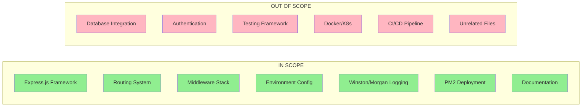

# Technical Specification

# 0. Agent Action Plan

## 0.1 Intent Clarification

### 0.1.1 Core Objective

Based on the provided requirements, the Blitzy platform understands that the objective is to **transform an existing basic HTTP server into a production-ready Express.js application** with enterprise-grade features. The user requires:

- **Framework Migration**: Replace the native Node.js `http` module implementation with Express.js framework
- **Routing System**: Implement a structured routing architecture to handle different endpoints
- **Middleware Stack**: Add essential middleware for security, logging, request parsing, and response handling
- **Environment Configuration**: Establish a robust environment-based configuration system for managing settings across development and production
- **Logging Infrastructure**: Implement comprehensive logging with Winston and Morgan for application and HTTP request logging
- **Production Deployment**: Configure PM2 process manager for production deployment with clustering, auto-restart, and monitoring capabilities

**Implicit Requirements Detected:**
- Security hardening via Helmet middleware
- CORS configuration for cross-origin requests
- Response compression for performance optimization
- JSON body parsing middleware
- Graceful error handling middleware
- Structured project organization following Node.js best practices

**Dependencies and Prerequisites:**
- Node.js v18+ runtime (verified: v20.19.6 installed)
- npm package manager (verified: v11.1.0 installed)
- Environment variable `DB_HOST` is configured (value: `db.internal:12345`)

### 0.1.2 Task Categorization

| Attribute | Value |
|-----------|-------|
| **Primary Task Type** | Configuration / Feature Enhancement |
| **Secondary Aspects** | Framework Migration, Production Deployment Setup, Logging Implementation |
| **Scope Classification** | Cross-cutting change (affects application entry point, configuration, routing, middleware, and deployment) |

### 0.1.3 Special Instructions and Constraints

- **Framework Selection**: Use Express.js v5.2.1 (latest stable version) which requires Node.js 18+
- **Process Manager**: Use PM2 v6.0.14 for production deployment
- **Logging Libraries**: Use Winston v3.19.0 and Morgan v1.10.1 for comprehensive logging
- **Environment Management**: Use dotenv v17.2.3 for environment variable management
- **Security Middleware**: Use Helmet v8.1.0 for security headers
- **Production Readiness**: Configure cluster mode in PM2 for multi-core utilization
- **Backward Compatibility**: Maintain port 3000 as default unless overridden by environment

**Methodological Requirements:**
- Follow Express.js 5.x patterns and conventions
- Structure middleware in a modular, maintainable format
- Implement environment-aware logging levels (debug in development, warn+ in production)
- Create PM2 ecosystem configuration file for reproducible deployments

### 0.1.4 Technical Interpretation

These requirements translate to the following technical implementation strategy:

| Requirement | Technical Implementation |
|-------------|-------------------------|
| Express.js framework | Install express@5.2.1, refactor `server.js` to use Express app instance with `app.listen()` |
| Routing | Create route modules under `src/routes/`, implement Express Router pattern |
| Middleware | Create middleware stack with helmet, cors, compression, express.json(), morgan |
| Environment config | Install dotenv, create `.env` and config loader module |
| Logging | Install winston + morgan, create logger utility, integrate morgan with winston stream |
| PM2 deployment | Install pm2 as dev dependency, create `ecosystem.config.js` with cluster mode |

**Execution Approach:**
- "To achieve Express.js migration, we will refactor `server.js` to import Express, create an app instance, and configure middleware and routes"
- "To implement routing, we will create a `src/routes/` directory with modular route files using Express.Router()"
- "To add logging, we will create `src/utils/logger.js` with Winston configuration and integrate Morgan middleware for HTTP logging"
- "To enable environment configuration, we will create `.env` file, `.env.example` template, and `src/config/index.js` loader"
- "To prepare for production deployment, we will create `ecosystem.config.js` with PM2 cluster configuration and add npm scripts"

## 0.2 Repository Scope Discovery

### 0.2.1 Comprehensive File Analysis

**Current Repository Structure:**

| Path | Type | Relevance | Purpose |
|------|------|-----------|---------|
| `server.js` | File | **Critical** | Basic HTTP server using native `http` module - primary target for Express.js migration |
| `package.json` | File | **Critical** | Package manifest with no dependencies - requires update with all new packages |
| `LoginTest.java` | File | Unrelated | Java test file - out of scope |
| `industry.csv` | File | Unrelated | Data file - out of scope |
| `blank1.txt` | File | Unrelated | Empty text file - out of scope |
| `blank2.txt` | File | Unrelated | Empty text file - out of scope |
| `blank3.txt` | File | Unrelated | Empty text file - out of scope |

**Current `server.js` Analysis:**

```javascript
const http = require('http');
const server = http.createServer((req, res) => {
  res.statusCode = 200;
  res.setHeader('Content-Type', 'text/plain');
  res.end('Hello, World!');
});
server.listen(3000, () => {
  console.log('Server running on port 3000');
});
```

**Current `package.json` Analysis:**

```json
{
  "name": "basic-http-server",
  "version": "1.0.0",
  "main": "index.js",
  "scripts": { "test": "echo..." },
  "author": "", "license": "ISC"
}
```

**Anomalies Detected:**
- `package.json` references `index.js` as main entry point, but the actual server file is `server.js`
- No dependencies currently defined
- No start script defined

### 0.2.2 Related File Discovery

**Files requiring creation for Express.js enhancement:**

| Category | Files to Create | Purpose |
|----------|-----------------|---------|
| Configuration | `.env`, `.env.example` | Environment variable definitions |
| Configuration | `src/config/index.js` | Centralized configuration loader |
| Routing | `src/routes/index.js` | Route aggregator |
| Routing | `src/routes/health.js` | Health check endpoint |
| Routing | `src/routes/api.js` | API routes |
| Middleware | `src/middleware/errorHandler.js` | Global error handling |
| Utilities | `src/utils/logger.js` | Winston logger configuration |
| Deployment | `ecosystem.config.js` | PM2 production configuration |
| Documentation | `README.md` | Project documentation |
| Git | `.gitignore` | Git ignore patterns |

### 0.2.3 Web Search Research Conducted

**Research Results Summary:**

| Topic | Finding | Source |
|-------|---------|--------|
| Express.js Latest Version | v5.2.1 released, requires Node.js 18+, includes security fixes for CVE-2024-45590 | npm registry |
| PM2 Latest Version | v6.0.14, supports cluster mode, built-in load balancer | npm registry |
| Winston Best Practices | Use JSON format for production, integrate with Morgan for HTTP logging | BetterStack Community Guide |
| Morgan Integration | Use stream option to pipe logs to Winston logger | Multiple sources |
| PM2 Ecosystem Config | Use `ecosystem.config.js` with apps and deploy sections | PM2 Documentation |
| Express.js 5 Changes | Promise support in middleware, updated path-to-regexp, Node.js 18+ minimum | Express.js Releases |

### 0.2.4 Existing Infrastructure Assessment

**Current Project Structure:**
- Flat structure with no directory organization
- No source directory (`src/`) pattern
- No configuration management
- No logging infrastructure
- No middleware implementation
- No route separation

**Existing Patterns to Preserve:**
- Port 3000 as default server port
- "Hello, World!" response for basic endpoint

**Build and Deployment:**
- No build configuration present
- No deployment scripts
- No process management configured

**Testing Infrastructure:**
- Only placeholder test script (`echo "Error: no test specified"`)
- No test framework installed

**Documentation:**
- No README.md present
- No API documentation

## 0.3 File Transformation Mapping

### 0.3.1 File-by-File Execution Plan

| Target File | Transformation | Source File/Reference | Purpose/Changes |
|-------------|----------------|----------------------|-----------------|
| `package.json` | UPDATE | `package.json` | Add Express.js and all dependencies, update main entry to server.js, add npm scripts for dev/start/prod |
| `server.js` | UPDATE | `server.js` | Convert from native http module to Express.js app with middleware stack and route mounting |
| `.env` | CREATE | N/A | Define environment variables for PORT, NODE_ENV, LOG_LEVEL, DB_HOST |
| `.env.example` | CREATE | `.env` | Template environment file for documentation (without sensitive values) |
| `src/config/index.js` | CREATE | N/A | Centralized configuration loader using dotenv |
| `src/routes/index.js` | CREATE | N/A | Route aggregator that mounts all sub-routers |
| `src/routes/health.js` | CREATE | N/A | Health check endpoint for load balancer/PM2 monitoring |
| `src/routes/api.js` | CREATE | N/A | Sample API routes demonstrating Express.js routing patterns |
| `src/middleware/errorHandler.js` | CREATE | N/A | Global error handling middleware for Express.js |
| `src/utils/logger.js` | CREATE | N/A | Winston logger configuration with console and file transports |
| `ecosystem.config.js` | CREATE | N/A | PM2 ecosystem configuration for production deployment with cluster mode |
| `.gitignore` | CREATE | N/A | Git ignore patterns for node_modules, .env, logs directory |
| `README.md` | CREATE | N/A | Project documentation with setup, usage, and deployment instructions |
| `logs/.gitkeep` | CREATE | N/A | Placeholder to ensure logs directory is tracked in git |

### 0.3.2 New Files Detail

**`.env`** - Environment configuration file
- Content type: Configuration
- Key sections: Server settings (PORT, NODE_ENV), logging (LOG_LEVEL), database (DB_HOST)
- Variables to define:
  - `PORT=3000`
  - `NODE_ENV=development`
  - `LOG_LEVEL=debug`
  - `DB_HOST=db.internal:12345`

**`src/config/index.js`** - Configuration loader
- Content type: Source code
- Based on: dotenv pattern
- Key functions: Load environment variables, provide typed config object with defaults

**`src/routes/index.js`** - Route aggregator
- Content type: Source code
- Based on: Express.Router() pattern
- Key sections: Import sub-routers, mount at appropriate paths

**`src/routes/health.js`** - Health check route
- Content type: Source code
- Based on: Express.Router() pattern
- Key endpoints: `GET /health` returning status and uptime

**`src/routes/api.js`** - API routes
- Content type: Source code
- Based on: Express.Router() pattern
- Key endpoints: `GET /api`, `GET /api/hello` (preserving original functionality)

**`src/middleware/errorHandler.js`** - Error handling middleware
- Content type: Source code
- Based on: Express.js error handling pattern
- Key functions: Catch errors, log with Winston, send appropriate response

**`src/utils/logger.js`** - Winston logger configuration
- Content type: Source code
- Based on: Winston + Morgan integration pattern
- Key features: Console transport, file transport, JSON format, log levels

**`ecosystem.config.js`** - PM2 configuration
- Content type: Configuration
- Based on: PM2 ecosystem file pattern
- Key sections: apps array with cluster mode, environment variables, log paths

### 0.3.3 Files to Modify Detail

**`package.json`** - Package manifest update
- Sections to update:
  - `main`: Change from `index.js` to `server.js`
  - `scripts`: Add `start`, `dev`, `prod`, `pm2:start`, `pm2:stop`, `pm2:logs`
  - `dependencies`: Add all production packages
  - `devDependencies`: Add pm2

- New content to add:
  ```json
  "scripts": {
    "start": "node server.js",
    "dev": "node --watch server.js",
    "prod": "NODE_ENV=production node server.js",
    "pm2:start": "pm2 start ecosystem.config.js",
    "pm2:stop": "pm2 stop ecosystem.config.js",
    "pm2:logs": "pm2 logs"
  }
  ```

**`server.js`** - Express.js migration
- Complete refactoring required:
  - Import Express instead of http
  - Import and apply middleware (helmet, cors, compression, morgan)
  - Import configuration module
  - Import logger utility
  - Mount routes
  - Add error handling middleware
  - Use `app.listen()` with proper startup logging

### 0.3.4 Configuration and Documentation Updates

**Configuration Changes:**

| Config File | Settings to Update | Impact |
|-------------|-------------------|--------|
| `package.json` | Add 8 dependencies, 6 scripts | Enables npm-based workflow |
| `.env` | Define 4+ environment variables | Runtime configuration |
| `ecosystem.config.js` | PM2 cluster settings | Production deployment behavior |

**Documentation Updates:**

| Doc File | Sections to Add |
|----------|-----------------|
| `README.md` | Installation, Quick Start, Environment Setup, Scripts, PM2 Deployment, Project Structure |

### 0.3.5 Cross-File Dependencies

**Import/Reference Updates:**

| File | Imports From | Purpose |
|------|-------------|---------|
| `server.js` | `./src/config/index.js` | Load configuration |
| `server.js` | `./src/utils/logger.js` | Application logging |
| `server.js` | `./src/routes/index.js` | Mount routes |
| `server.js` | `./src/middleware/errorHandler.js` | Error handling |
| `src/routes/index.js` | `./health.js`, `./api.js` | Sub-route mounting |
| `src/middleware/errorHandler.js` | `../utils/logger.js` | Error logging |
| `src/utils/logger.js` | `../config/index.js` | Log level configuration |

**Configuration Sync Requirements:**
- `.env` variables must match `src/config/index.js` expected keys
- `ecosystem.config.js` PORT must align with `.env` PORT
- Logger LOG_LEVEL must be valid Winston level

## 0.4 Dependency Inventory

### 0.4.1 Key Private and Public Packages

**Production Dependencies:**

| Registry | Package Name | Version | Purpose |
|----------|--------------|---------|---------|
| npm | express | 5.2.1 | Web application framework - core server implementation |
| npm | dotenv | 17.2.3 | Environment variable loader from .env files |
| npm | winston | 3.19.0 | Application logging library with multiple transports |
| npm | morgan | 1.10.1 | HTTP request logger middleware for Express |
| npm | helmet | 8.1.0 | Security middleware - sets various HTTP headers |
| npm | cors | 2.8.5 | Cross-Origin Resource Sharing middleware |
| npm | compression | 1.8.1 | Response compression middleware (gzip/deflate) |

**Development Dependencies:**

| Registry | Package Name | Version | Purpose |
|----------|--------------|---------|---------|
| npm | pm2 | 6.0.14 | Production process manager with clustering and monitoring |

### 0.4.2 Dependency Updates

**New Dependencies to Add:**

All dependencies listed above are new additions. The current `package.json` has zero dependencies.

**Installation Command:**
```bash
npm install express@5.2.1 dotenv@17.2.3 winston@3.19.0 morgan@1.10.1 helmet@8.1.0 cors@2.8.5 compression@1.8.1
npm install --save-dev pm2@6.0.14
```

**Dependencies Breakdown by Purpose:**

| Category | Packages | Combined Size (approx) |
|----------|----------|----------------------|
| Core Framework | express | ~200KB |
| Configuration | dotenv | ~30KB |
| Logging | winston, morgan | ~500KB |
| Security | helmet | ~50KB |
| Performance | compression | ~30KB |
| CORS | cors | ~15KB |
| Process Management | pm2 (dev) | ~2MB |

### 0.4.3 Import/Reference Updates

**Files Requiring Import Updates:**

| File | Import Statements to Add |
|------|-------------------------|
| `server.js` | `const express = require('express');` |
| `server.js` | `const helmet = require('helmet');` |
| `server.js` | `const cors = require('cors');` |
| `server.js` | `const compression = require('compression');` |
| `server.js` | `const morgan = require('morgan');` |
| `src/config/index.js` | `require('dotenv').config();` |
| `src/utils/logger.js` | `const winston = require('winston');` |

**Import Transformation Rules:**

| Context | Old Import | New Import | Apply to |
|---------|-----------|------------|----------|
| Server entry | `const http = require('http');` | `const express = require('express');` | `server.js` |
| Server creation | `http.createServer(...)` | `const app = express();` | `server.js` |
| Server listen | `server.listen(...)` | `app.listen(...)` | `server.js` |

### 0.4.4 Package.json Final Structure

**Target `package.json` dependencies section:**

```json
{
  "dependencies": {
    "compression": "^1.8.1",
    "cors": "^2.8.5",
    "dotenv": "^17.2.3",
    "express": "^5.2.1",
    "helmet": "^8.1.0",
    "morgan": "^1.10.1",
    "winston": "^3.19.0"
  },
  "devDependencies": {
    "pm2": "^6.0.14"
  }
}
```

### 0.4.5 Version Compatibility Matrix

| Package | Min Node.js | Express 5.x Compatible | Notes |
|---------|-------------|----------------------|-------|
| express@5.2.1 | 18.0.0 | ✅ (is Express 5) | Core framework |
| dotenv@17.2.3 | 18.0.0 | ✅ | No Express dependency |
| winston@3.19.0 | 12.0.0 | ✅ | Standalone logger |
| morgan@1.10.1 | 0.8.0 | ✅ | Express middleware compatible |
| helmet@8.1.0 | 18.0.0 | ✅ | Express middleware compatible |
| cors@2.8.5 | 0.10.0 | ✅ | Express middleware compatible |
| compression@1.8.1 | 0.10.0 | ✅ | Express middleware compatible |
| pm2@6.0.14 | 12.0.0 | ✅ | Process manager (runtime agnostic) |

**Current Environment Compatibility:**
- Node.js v20.19.6 ✅ (exceeds all requirements)
- npm v11.1.0 ✅ (fully compatible)

## 0.5 Implementation Design

### 0.5.1 Technical Approach

**Primary Objectives with Implementation Approach:**

| Goal | Implementation |
|------|---------------|
| Achieve Express.js migration | Replace `http.createServer()` with `express()` app, maintain same port (3000), preserve "Hello, World!" endpoint |
| Implement routing system | Create `src/routes/` directory with modular router files, aggregate in index.js, mount on app |
| Add security middleware | Install and configure Helmet for HTTP security headers, CORS for cross-origin support |
| Configure logging | Create Winston logger with console/file transports, integrate Morgan for HTTP request logging |
| Enable environment config | Create `.env` file with dotenv loader, centralize config in `src/config/index.js` |
| Prepare PM2 deployment | Create `ecosystem.config.js` with cluster mode, add npm scripts for PM2 commands |

**Logical Implementation Flow:**

1. **First**, establish the project foundation by updating `package.json` with all dependencies and proper entry point configuration
2. **Second**, create the configuration layer (`.env`, `src/config/index.js`) to ensure all modules have access to environment settings
3. **Third**, implement the logging infrastructure (`src/utils/logger.js`) as it's required by other components
4. **Fourth**, create the middleware components (`src/middleware/errorHandler.js`) for proper error handling
5. **Fifth**, build the routing layer (`src/routes/*.js`) following Express.Router() pattern
6. **Sixth**, refactor `server.js` to wire together all components with Express.js
7. **Finally**, add PM2 configuration and documentation for production deployment

### 0.5.2 Component Impact Analysis

**Direct Modifications Required:**

| Component | Modification | Impact |
|-----------|-------------|--------|
| `server.js` | Complete refactor from http to Express | Application entry point transformation |
| `package.json` | Add dependencies, scripts, fix main entry | Build and runtime configuration |

**Indirect Impacts:**

| Component | Reason | Required Action |
|-----------|--------|-----------------|
| Process management | Server start method changes | Add PM2 ecosystem config |
| Deployment | New startup scripts needed | Update npm scripts |
| Runtime behavior | Middleware affects request handling | Test all endpoints |

**New Components Introduction:**

| Component | Type | Responsibility | Rationale |
|-----------|------|----------------|-----------|
| `src/config/index.js` | Module | Centralized configuration management | Single source of truth for all config values |
| `src/utils/logger.js` | Module | Application-wide logging | Consistent logging format, multiple outputs |
| `src/routes/*.js` | Modules | HTTP endpoint handling | Separation of concerns, maintainability |
| `src/middleware/errorHandler.js` | Module | Global error handling | Consistent error responses, logging |
| `ecosystem.config.js` | Config | PM2 process configuration | Production deployment support |

### 0.5.3 Architecture Diagram

```mermaid
graph TB
    subgraph "Client Layer"
        Client[HTTP Client]
    end
    
    subgraph "Express.js Application"
        subgraph "Middleware Stack"
            Helmet[Helmet Security]
            CORS[CORS Handler]
            Compression[Response Compression]
            Morgan[Morgan Logger]
            JSONParser[JSON Parser]
        end
        
        subgraph "Routes"
            HealthRoute[/health]
            APIRoute[/api/*]
            RootRoute[/]
        end
        
        subgraph "Error Handling"
            ErrorHandler[Error Handler Middleware]
        end
    end
    
    subgraph "Support Services"
        Logger[Winston Logger]
        Config[Configuration]
    end
    
    subgraph "PM2 Process Manager"
        PM2[PM2 Cluster Mode]
    end
    
    Client --> PM2
    PM2 --> Helmet
    Helmet --> CORS
    CORS --> Compression
    Compression --> Morgan
    Morgan --> JSONParser
    JSONParser --> HealthRoute
    JSONParser --> APIRoute
    JSONParser --> RootRoute
    HealthRoute --> ErrorHandler
    APIRoute --> ErrorHandler
    RootRoute --> ErrorHandler
    ErrorHandler --> Client
    Morgan --> Logger
    ErrorHandler --> Logger
    Config --> Logger
```

### 0.5.4 Middleware Stack Order

The middleware stack must be configured in the following order for proper request processing:

| Order | Middleware | Purpose |
|-------|-----------|---------|
| 1 | `helmet()` | Set security HTTP headers first |
| 2 | `cors()` | Handle CORS preflight before processing |
| 3 | `compression()` | Compress responses |
| 4 | `morgan('combined', { stream })` | Log incoming requests |
| 5 | `express.json()` | Parse JSON request bodies |
| 6 | `express.urlencoded()` | Parse URL-encoded bodies |
| 7 | Routes | Handle application routes |
| 8 | 404 Handler | Catch unmatched routes |
| 9 | Error Handler | Global error handling (must be last) |

### 0.5.5 Critical Implementation Details

**Express.js 5.x Specific Patterns:**
- Middleware can return rejected promises (automatic error catching)
- Use `express.json()` instead of separate body-parser package
- `res.redirect('back')` magic string removed - use explicit referrer

**Winston Logger Configuration:**

```javascript
// Log levels configuration
const levels = {
  error: 0, warn: 1, info: 2,
  http: 3, debug: 4
};
```

**Morgan Integration with Winston:**
- Use `stream` option to pipe Morgan output to Winston
- Configure at `http` level for request logging

**PM2 Cluster Mode:**
- Use `exec_mode: 'cluster'` for multi-core utilization
- Set `instances: 'max'` for automatic scaling to CPU count
- Configure `watch: false` for production stability

**Error Handling Strategy:**
- Catch synchronous errors in route handlers
- Handle async errors with try/catch or promise rejection
- Log all errors with Winston before responding
- Return structured JSON error responses

**Data Flow:**
1. Request enters through PM2 load balancer
2. Morgan logs request details
3. Helmet adds security headers
4. CORS validates origin
5. Compression prepares response
6. Route handler processes request
7. Response sent with appropriate status
8. Error handler catches any failures

## 0.6 Scope Boundaries

### 0.6.1 Exhaustively In Scope

**Source Code Changes:**

| Pattern | Description |
|---------|-------------|
| `server.js` | Main application entry point - complete refactor to Express.js |
| `src/config/index.js` | Configuration loader module (CREATE) |
| `src/routes/*.js` | All route modules: index.js, health.js, api.js (CREATE) |
| `src/middleware/*.js` | All middleware modules: errorHandler.js (CREATE) |
| `src/utils/*.js` | All utility modules: logger.js (CREATE) |

**Configuration Updates:**

| Pattern | Description |
|---------|-------------|
| `package.json` | Add dependencies, scripts, fix main entry |
| `.env` | Environment variables for runtime configuration (CREATE) |
| `.env.example` | Environment template for documentation (CREATE) |
| `ecosystem.config.js` | PM2 deployment configuration (CREATE) |

**Documentation Updates:**

| Pattern | Description |
|---------|-------------|
| `README.md` | Project documentation with setup and deployment (CREATE) |
| `.gitignore` | Git ignore patterns for node_modules, .env, logs (CREATE) |

**Build/Deployment:**

| Pattern | Description |
|---------|-------------|
| `ecosystem.config.js` | PM2 ecosystem configuration with cluster mode |
| `package.json` scripts | npm scripts for dev, prod, and PM2 management |

**Directory Structure:**

| Pattern | Description |
|---------|-------------|
| `src/` | Source code directory (CREATE) |
| `src/config/` | Configuration modules (CREATE) |
| `src/routes/` | Route modules (CREATE) |
| `src/middleware/` | Middleware modules (CREATE) |
| `src/utils/` | Utility modules (CREATE) |
| `logs/` | Log files directory with .gitkeep (CREATE) |

### 0.6.2 Explicitly Out of Scope

**Related Features NOT Included:**

| Feature | Reason |
|---------|--------|
| Database integration | User did not request database setup beyond acknowledging DB_HOST |
| Authentication/Authorization | Not specified in requirements |
| API versioning | Not specified in requirements |
| Rate limiting | Not specified in requirements |
| Session management | Not specified in requirements |
| Template rendering | Not specified (API-focused) |

**Performance Optimizations NOT Included:**

| Optimization | Reason |
|--------------|--------|
| Caching layer (Redis) | Beyond basic requirements |
| CDN configuration | Infrastructure-level concern |
| Load balancer configuration | PM2 cluster mode provides basic load balancing |

**Refactoring NOT Included:**

| Item | Reason |
|------|--------|
| `LoginTest.java` | Unrelated to Node.js server |
| `industry.csv` | Unrelated data file |
| `blank*.txt` | Empty placeholder files |

**Additional Tooling NOT Included:**

| Tool | Reason |
|------|--------|
| Testing framework | Not specified in requirements |
| Linting (ESLint) | Not specified in requirements |
| Code formatting (Prettier) | Not specified in requirements |
| TypeScript conversion | Not specified in requirements |
| Docker containerization | Not specified in requirements |
| CI/CD pipeline | Not specified in requirements |

**Future Enhancements NOT Part of Current Request:**

| Enhancement | Status |
|-------------|--------|
| WebSocket support | Future consideration |
| GraphQL endpoint | Future consideration |
| Microservices architecture | Future consideration |
| Kubernetes deployment | Future consideration |
| Monitoring dashboards | Future consideration |

### 0.6.3 Boundary Summary



## 0.7 Execution Parameters

### 0.7.1 Special Execution Instructions

**Process-Specific Requirements:**

| Requirement | Details |
|-------------|---------|
| Package Installation | Use exact versions specified to ensure compatibility |
| Directory Creation | Create `src/` directory structure before file creation |
| Environment Setup | Create `.env` file before running application |
| PM2 Global Install | PM2 should also be installed globally for CLI access |

**Tools and Platforms:**

| Tool | Usage | Installation |
|------|-------|--------------|
| npm | Package management | Pre-installed |
| Node.js v20.19.6 | Runtime | Pre-installed |
| PM2 | Production process management | Install via npm |

**Quality Requirements:**

| Aspect | Requirement |
|--------|-------------|
| Code Style | Follow standard JavaScript conventions |
| Error Handling | All routes must have proper error handling |
| Logging | All significant events must be logged |
| Configuration | All configurable values must come from environment |

**Deployment Considerations:**

| Consideration | Approach |
|---------------|----------|
| Zero-downtime reload | Use `pm2 reload` instead of restart |
| Log rotation | Configure via PM2 log management |
| Process monitoring | Use PM2 built-in monitoring |
| Startup on boot | Use `pm2 startup` command |

### 0.7.2 Constraints and Boundaries

**Technical Constraints:**

| Constraint | Details |
|------------|---------|
| Node.js Version | Must use Node.js 18+ (Express 5.x requirement) |
| Port | Default to 3000, configurable via PORT env var |
| Log Level | Debug in development, info/warn in production |
| Cluster Mode | Use max available CPUs in production |

**Process Constraints:**

| Constraint | Details |
|------------|---------|
| No Build Step | Plain JavaScript, no transpilation required |
| No Database Migrations | Database configuration referenced but not implemented |
| Stateless Design | Application must be stateless for cluster mode |

**Output Constraints:**

| Constraint | Details |
|------------|---------|
| JSON Responses | API endpoints should return JSON |
| Structured Logs | Winston logs in JSON format for production |
| Health Check | Must include `/health` endpoint for monitoring |

**Compatibility Requirements:**

| Requirement | Details |
|-------------|---------|
| Express 5.x | Use Express 5 patterns and conventions |
| ES6+ Syntax | Use modern JavaScript features (const, arrow functions) |
| CommonJS Modules | Use `require()` for module imports |

### 0.7.3 Environment Configuration

**Required Environment Variables:**

| Variable | Default | Required | Description |
|----------|---------|----------|-------------|
| `PORT` | 3000 | No | Server listening port |
| `NODE_ENV` | development | No | Environment mode |
| `LOG_LEVEL` | debug | No | Winston logging level |
| `DB_HOST` | N/A | No | Database host (referenced, not implemented) |

**PM2 Environment Configuration:**

| Variable | Development | Production |
|----------|-------------|------------|
| `NODE_ENV` | development | production |
| `instances` | 1 | max (auto-scale to CPU count) |
| `watch` | true | false |
| `max_memory_restart` | N/A | 500M |

### 0.7.4 npm Scripts Reference

| Script | Command | Purpose |
|--------|---------|---------|
| `npm start` | `node server.js` | Start server in default mode |
| `npm run dev` | `node --watch server.js` | Start with file watching (development) |
| `npm run prod` | `NODE_ENV=production node server.js` | Start in production mode |
| `npm run pm2:start` | `pm2 start ecosystem.config.js` | Start with PM2 cluster |
| `npm run pm2:stop` | `pm2 stop ecosystem.config.js` | Stop PM2 processes |
| `npm run pm2:restart` | `pm2 restart ecosystem.config.js` | Restart PM2 processes |
| `npm run pm2:logs` | `pm2 logs` | View PM2 logs |

### 0.7.5 File Creation Order

The implementation must follow this order to satisfy dependencies:

| Order | File(s) | Dependency Reason |
|-------|---------|-------------------|
| 1 | `package.json` | Must install dependencies first |
| 2 | `.env`, `.env.example` | Configuration needed by other modules |
| 3 | Directory structure | `src/`, `logs/` directories |
| 4 | `src/config/index.js` | Required by logger and server |
| 5 | `src/utils/logger.js` | Required by middleware and routes |
| 6 | `src/middleware/errorHandler.js` | Required by server |
| 7 | `src/routes/health.js`, `src/routes/api.js` | Route modules |
| 8 | `src/routes/index.js` | Route aggregator |
| 9 | `server.js` | Main application (all dependencies met) |
| 10 | `ecosystem.config.js` | PM2 config (server must exist) |
| 11 | `.gitignore`, `README.md` | Documentation (last) |

## 0.8 Special Instructions

### 0.8.1 Task-Specific Requirements

**Framework and Library Versions (User Verified via Research):**

| Package | Version | Rationale |
|---------|---------|-----------|
| express | 5.2.1 | Latest stable with security fixes |
| pm2 | 6.0.14 | Latest with cluster mode support |
| winston | 3.19.0 | Latest stable for logging |
| morgan | 1.10.1 | Latest HTTP logger middleware |
| helmet | 8.1.0 | Latest security middleware |
| cors | 2.8.5 | Stable CORS middleware |
| compression | 1.8.1 | Stable compression middleware |
| dotenv | 17.2.3 | Latest environment loader |

**Express.js 5.x Specific Patterns to Follow:**

- Use built-in `express.json()` and `express.urlencoded()` instead of separate body-parser
- Handle promise rejections in middleware (automatic in Express 5)
- Avoid deprecated `res.redirect('back')` - use `req.get('Referrer') || '/'`
- Status codes must be valid (100-999 range enforced)

**PM2 Production Best Practices:**

- Use ecosystem.config.js for reproducible deployments
- Enable cluster mode with `exec_mode: 'cluster'`
- Set `instances: 'max'` for automatic CPU scaling
- Configure `max_memory_restart` for memory leak protection
- Disable watch mode in production (`watch: false`)
- Use `pm2 startup` for boot persistence

**Logging Best Practices:**

- Use structured JSON logging in production
- Include timestamps in all log entries
- Use appropriate log levels: error, warn, info, http, debug
- Integrate Morgan with Winston via stream option
- Store logs in `logs/` directory with rotation consideration

### 0.8.2 Code Style Guidelines

**Module Pattern:**
```javascript
// Use CommonJS modules
const express = require('express');
module.exports = router;
```

**Error Handling Pattern:**
```javascript
// Express 5 error handling
app.use((err, req, res, next) => {
  logger.error(err.stack);
  res.status(500).json({ error: 'Server Error' });
});
```

**Configuration Access Pattern:**
```javascript
// Centralized config access
const config = require('./src/config');
app.listen(config.port, ...);
```

### 0.8.3 Preserved Functionality

The following existing behavior must be maintained:

| Behavior | Original | After Migration |
|----------|----------|-----------------|
| Default Port | 3000 | 3000 (from PORT env or default) |
| Hello World Response | `res.end('Hello, World!')` | `res.send('Hello, World!')` at `/api/hello` |
| Content Type | text/plain | text/plain for hello endpoint |

### 0.8.4 Security Considerations

**Helmet Default Protections:**
- Content Security Policy
- X-Content-Type-Options: nosniff
- X-Frame-Options: DENY
- X-XSS-Protection
- Strict-Transport-Security (HSTS)

**Environment Security:**
- Never commit `.env` to version control
- Use `.env.example` as template
- Sanitize log output for sensitive data
- Configure CORS appropriately for production

### 0.8.5 Validation Checklist

Before marking implementation complete, verify:

| Check | Verification Method |
|-------|---------------------|
| Express server starts | `npm start` - server listening message |
| Health endpoint works | `GET /health` returns 200 with status |
| API endpoint works | `GET /api/hello` returns "Hello, World!" |
| Logging functions | Check console output and `logs/` directory |
| PM2 cluster starts | `npm run pm2:start` shows multiple workers |
| Environment config loads | Changing PORT in .env affects server |
| Error handling works | Invalid route returns 404 JSON response |
| Security headers present | Check response headers with curl -I |

### 0.8.6 Testing Commands

**Manual Verification Commands:**

```bash
# Start server
npm start

#### Test health endpoint
curl http://localhost:3000/health

#### Test API endpoint
curl http://localhost:3000/api/hello

#### Test root endpoint
curl http://localhost:3000/

#### Check security headers
curl -I http://localhost:3000/health

#### Test PM2 cluster mode
npm run pm2:start
pm2 list
pm2 monit

#### View logs
npm run pm2:logs
```

### 0.8.7 Rollback Strategy

If issues arise, the original `server.js` functionality can be restored by:

1. Reverting `server.js` to native http module
2. Removing all dependencies from `package.json`
3. Deleting `src/` directory
4. Deleting configuration files (`.env`, `ecosystem.config.js`)

The original server.js code for reference:
```javascript
const http = require('http');
const server = http.createServer((req, res) => {
  res.statusCode = 200;
  res.setHeader('Content-Type', 'text/plain');
  res.end('Hello, World!');
});
server.listen(3000);
```

